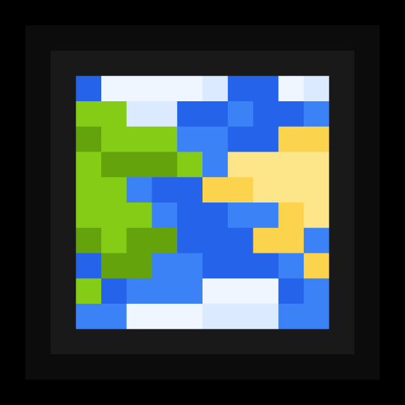

<p align="center"><a href="https://modrinth.com/mod/biolith"></a></p>

# Biolith
A biome placement mod focusing on configurability and consistent
distribution of modded biomes

## Warning: Somewhat Experimental

This mod is still somewhat experimental.  Biome selection strategies may change,
resulting in biomes being placed at different locations in existing worlds.

## Extent of Current Features

At this time, aside from any new things I've implemented and forgotten
to update here, the following features are present:

* From v1.2.0-alpha.1, Biolith supports all four major mod loaders!
* From v2.0.0-alpha.1, biome placement and surface rules can be added via datapacks.

* Place an Overworld, Nether, or End biome at a specified noise point.
* Remove a vanilla/datapack Overworld, Nether, or End biome from all noise points.
* Replace an Overworld, Nether, or End biome entirely or in part.
* Add a sub-biome to an Overworld, Nether, End, or modded biome.
* (End biome placement uses custom noise and is only available in 1.20+.)

* Register custom surface rules.
* Override vanilla surfaces using custom surface builders.

* Fully compatible with TerraBlender and Fabric Biome API biomes.
* Somewhat compatible with BCLib (biome placement will be modified by BCLib).
* Can place biomes in Modern Beta worlds since 1.2.0-beta.1.
* Can place biomes in Moderner Beta worlds since 3.0.3.

## Releases via Maven

The instructions below are for Biolith 3.0.4 for Minecraft 1.21+.  If you are
using versions of Biolith before 1.2.0, only Fabric/Quilt is supported, and
the artifact ID is just `biolith`.

Much like Terraform API, add the Terraformers maven repository to your `build.gradle`:

```
repositories {
    maven {
        name = 'TerraformersMC'
        url = 'https://maven.terraformersmc.com/'
    }
}
```

And add the Biolith version for your loader (fabric, forge, or neoforge)
to the dependencies section of `build.gradle`:

```
dependencies {
    modImplementation("com.terraformersmc:biolith-fabric:${project.biolith_version}")
}
```

If you wish to include Biolith in your mod for distribution, wrap the `modImplementation()` with an `include()`

Finally, set the Biolith version you want in `gradle.properties`:

```
biolith_version=3.0.4
```

For convenience, [Biolith can also be downloaded from Modrinth](https://modrinth.com/mod/biolith).

## Examples

Check out [Biolith Examples](https://github.com/gniftygnome/biolith-examples)
for a complete multi-loader biome placement implementation using Biolith,
with examples of some of Biolith's capabilities.  I will add more examples
over time.
